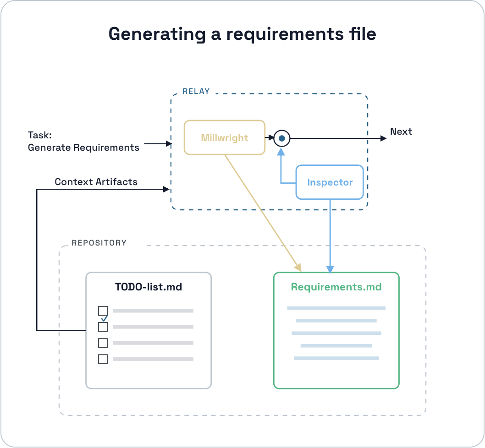
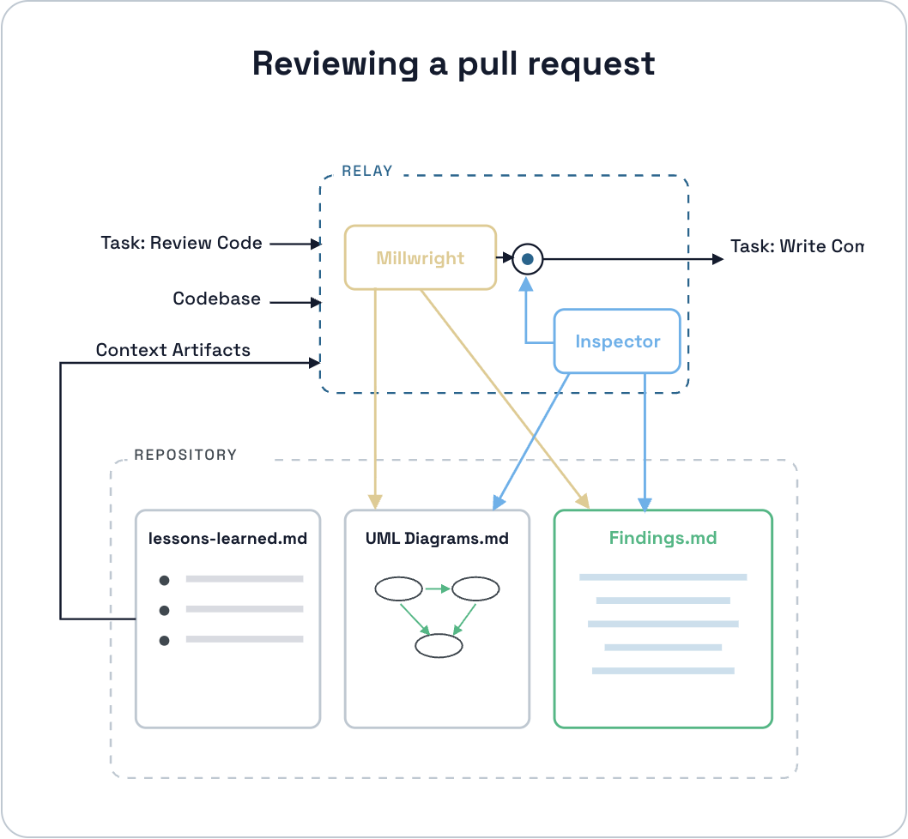
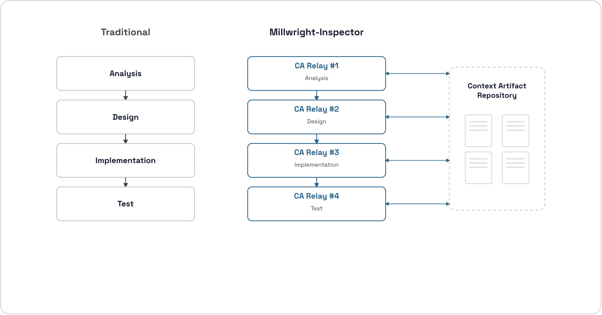
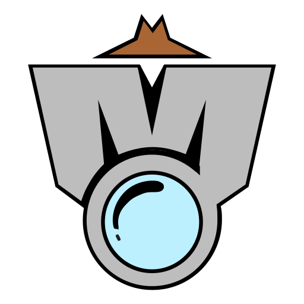

> **TL;DR.** Two roles. An AI agent (the millwright) drafts every artifact in the workflow. A human (the inspector) reviews each one. Each artifact is a Markdown file that doubles as the next step's input. The workflow only moves forward when the inspector approves. The pattern is called the Context Artifact Relay.

## What is Millwright-Inspector

A couple of years ago, getting an AI to finish a line of code felt like the high-water mark. Today the same tools can take a spec, plan an implementation, write the code, and put up a pull request more or less unsupervised. The way most teams structure software development (analysis, design, implementation, testing, review) hasn't really changed. What's changed is who's doing the typing.

[Millwright-Inspector](https://millwright-inspector.dev/) is a methodology for the gap that opens up there. It doesn't replace the stages you already work in. It adds a small amount of structure around two things: where the agent's work lives, and how that work moves from one step to the next. Each step produces a file. A human reviews the file. Once the file is approved, it becomes the input to the next step. Nothing else moves forward.

> *Millwright-Inspector is a methodology where an AI agent generates each artifact of a software workflow, a human reviews it, and that approval is what advances the next step.*

That sentence covers the whole mechanism. The rest of this post is just filling in what each piece looks like and why it's shaped that way. ([millwright-inspector.dev](https://millwright-inspector.dev/) has a longer treatment of the methodology if you want one after this.)

## The actors and their roles

The methodology defines two roles. The names sound a little odd at first, and that's intentional.

**The Millwright** is the AI agent. Claude Code, Cursor in agent mode, Aider, Codex CLI; whichever one your team is using already. The name comes from old factory floors: a millwright is the person who installs, maintains, and repairs the machines that produce the factory's output. In software the codebase is the factory and each feature is a machine being assembled. The Millwright is responsible from generating the artifacts, summoning agents and put the context-artifacts into their contexts, progression of workflow when the inspector approves, so basically it is responsible from making the machine work.

**The Inspector** is the human. You. The inspector supplies the raw materials (transcripts, notes, design hand-offs, scope decisions), reviews every artifact the millwright produces, and signals when the workflow can move on. The inspector doesn't write production artifacts directly. Their authority is in approvals, in prompts, in the occasional edit to an inspection file.

Why rename "developer" at all? Because over the years the word came to mean about eight different jobs at once: architect, coder, tester, debugger, code-reviewer, sometimes the PM. Pulling the building work out from under that umbrella leaves both the AI and the human with cleaner shapes. It also sidesteps the "AI took the developer's job" framing, which was never quite right. The work didn't disappear. It just got cut differently.

Here's the quick split:

| | Millwright (AI) | Inspector (human) |
| --- | --- | --- |
| Generates the artifacts | Yes | No |
| Reviews the artifacts | No | Yes |
| Advances the workflow | On approval | By approving |
| Owns the git branch | No | Yes |
| Owns the raw inputs | No | Yes |

## The elements of the workflow

Three building blocks carry the methodology: the **context artifact**, the **Context Artifact Relay** that moves it forward, and the **Context Artifact Repository** that holds everything between steps.

### Context artifacts

A context artifact is one of the more important pieces and also one of the simplest. It's a Markdown file the workflow produces at some stage. What makes it useful is that it does two jobs at the same time.

The first job is human review. The inspector opens the file, reads it, decides whether it's good enough.

The second job is feeding the next agent. When the next step starts running, the same file is what the agent reads to figure out its job. The `requirements.md` an inspector approves at the design step is the same `requirements.md` the implementer reads at the implementation step. The UML diagram a reviewer skims is the diagram a later refactor reads to understand how the system used to look.

A typical workflow ends up producing a handful of these:

- `requirements.md` for what's being built.
- `manual-test-plan.md` for how you'd verify it.
- Sequence and component diagrams (`.puml` files).
- `inspector-review.md` for findings from a code review.
- `change-summary.md` for the next cycle to read.

There's no second format for the agent and a first format for the human. They read the same file.

### The Context Artifact Relay

*A Context Artifact Relay. The millwright drafts; the inspector approves; the artifact moves.*

This is where the methodology gets its name.

Think about an electrical relay for a second. It's a switch that sits open by default. Nothing passes through. A separate, small control signal energizes its coil, the switch closes, and the main circuit can finally carry current. Without the signal, the relay just sits there.

At every step in the workflow the millwright drafts an artifact. Maybe it's `requirements.md`. Maybe it's a set of diagrams. Maybe it's a review-findings file. The artifact gets written to disk and then... nothing happens. The next step doesn't fire on its own. The artifact sits there, waiting.

The inspector's approval is the control signal. When they approve, the relay closes, and the artifact moves to whatever runs next.

> *The millwright fills the payload. The inspector throws the switch.*

A few useful things fall out of organizing the work this way.

It's **durable**. The artifact is a Markdown file on disk, so it survives anything that happens to your session. If your AI agent's context window resets, if you swap models mid-cycle, if you set the workflow down on Friday and come back to it on Monday, the file is still right there. The workflow waits.

It's **layered**. What flows from one step to the next isn't a full dump of everything the workflow has accumulated. It's a compact briefing of just what the next step actually needs. You can have a huge body of background and still keep each step's input small.

And it **cascades**. One approval can chain several automated steps together. Approving a design can trigger requirements regeneration, diagram updates, and an implementation plan, all in one go.

Two relays from different parts of a real cycle, to make this concrete.

*Generating a requirements file. Context: an approved TODO list. Output: an approved `requirements.md`.*

The millwright reads the selected TODO items, writes a `requirements.md`, and stops. The inspector opens the draft, asks for changes (or doesn't), approves. The approved file becomes the input to whatever relay is next.

*Reviewing a pull request. Context: the codebase, the project's lessons-learned, the workflow's UML diagrams. Output: an approved findings file.*

Same shape, very different content. The millwright reads the codebase against the project's accumulated lessons and the existing UML diagrams, then writes a structured `inspector-review.md` with the findings. The inspector goes through them, keeps the ones worth keeping, defers the rest, approves. The findings file is what the next loop (the fix-and-re-review loop) reads.

### The Context Artifact Repository

The artifacts have to live somewhere. In Millwright-Inspector they live in three folders that sit alongside your codebase:

| Folder | What's in it |
| --- | --- |
| **Journal** | The raw inputs you started from. Meeting transcripts, notes, specs, PDFs, design hand-offs from Figma. |
| **Quest** | The working state of the current cycle. Task list, summaries, the queue of features, progress so far. |
| **Workflow Stream** | The per-feature artifacts. Requirements, diagrams, reviews, manual test plans, completion summaries. |

That's the whole repository. Three folders, plain Markdown inside them.

Two consequences worth pointing out. The first is that workflows stop depending on a live chat session. Everything important is on disk, so context-window compaction, model switches, and long pauses between work sessions stop being workflow-ending problems. Drop a workflow on Friday, pick it up two weeks later. Open the folder, the state is right there.

The second is that the codebase becomes a fourth artifact. It used to be that only developers really read the codebase. With agents in the picture, anyone with an agent can ask grounded questions of the code. They just need read access.

## Putting it side by side

*The familiar stages stay. Millwright-Inspector adds a relay at each step and a shared repository.*

The way most teams structure the work (analysis, design, implementation, testing) doesn't change. Millwright-Inspector adds a relay at each step, the inspect-and-approve pattern from the section above, plus a shared repository the relays write to and read from. That's it. The stages are the same. The structure around them is what's new.

## Where this starts paying off

The shape above keeps a single feature predictable, which is nice on its own. But the moment a team is using it, a few other things fall out for free.

**One inspector, several workflows in flight.** Because each relay holds its artifact on disk and waits, the inspector doesn't have to keep a workflow loaded in their head. You can approve workflow A's requirements at 10:00, and while A's next step runs, switch over and review workflow B's diagrams at 10:30. By the time you're back, A's next relay is ready for you. The cost of switching between workflows is roughly the cost of opening a different folder.

**Inspectors can review each other.** A generated `requirements.md` is just a file. So is `inspector-review.md`. You can open your own workflow's design to a peer for a second pair of eyes, the same way you'd send a pull request. They read it, leave comments, approve. Cross-inspector review isn't a new feature you have to add. It's just what happens when artifacts are files.

**Tasks become things anyone can query.** When TODOs live in the repository alongside the rest of the workflow instead of only in Jira or Linear, anyone with an agent can ask questions about them. A PM can ask theirs: "what shipped this week", "which workflows have been blocked for more than an hour", "is the loyalty feature done". They don't have to interrupt the team to get an answer.

**The codebase joins the readable inputs.** Source code has historically been a developer-only artifact. Agents flatten that a bit. A PM, an analyst, or even a customer can use their own agent to ask "how is rate-limiting implemented for the public API", or "what changed in pricing last sprint". The answer comes from the code itself, not from someone trying to remember.

**Small custom tools become cheap.** Every artifact is plain Markdown with structured frontmatter. That means a notifier when a workflow finishes is twenty lines of script. So is a dashboard for blocked workflows, or a cycle-time metric, or a weekly digest. The methodology doesn't ship these for you. It just makes them small enough to write.

## Trying it

None of this is locked to a specific tool. The relay shape, the artifact-as-handoff, the three-folder repository; you can build a version of all of these on top of Claude Code, Cursor, Aider, Codex CLI, or whatever your team is using already. The methodology is the structure. The agent is just the worker.

The version I've been building is a Claude Code plugin, *Millwright-Inspector Development Machine*. It implements the relays, the three repositories, and a small set of slash commands the inspector uses to drive the cycle. The site at [millwright-inspector.dev](https://millwright-inspector.dev/) has a longer walkthrough. The plugin source is here:



If your team is figuring out its own version of this (what an inspector looks like in your setup, what the artifacts should be, how the relays get signalled), I'd like to hear about it. Comments are open below.
